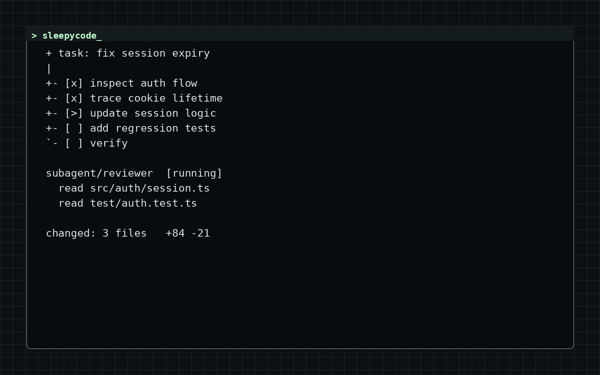
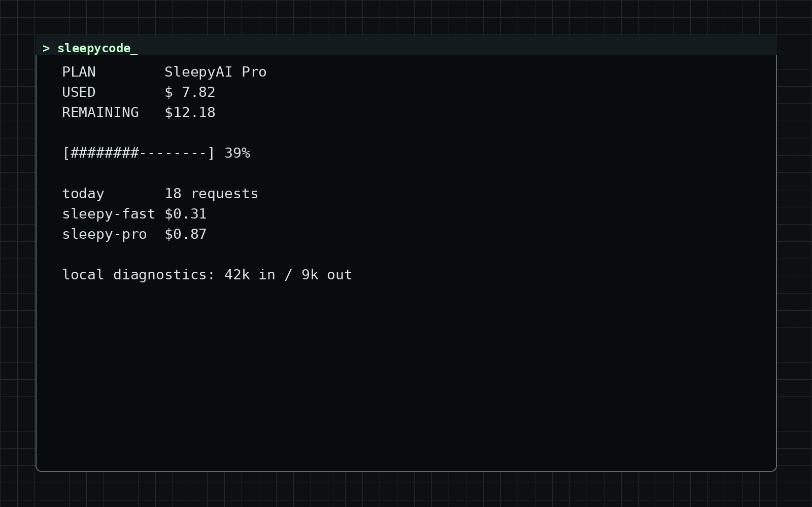
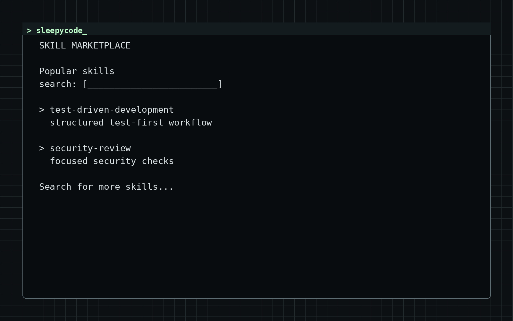
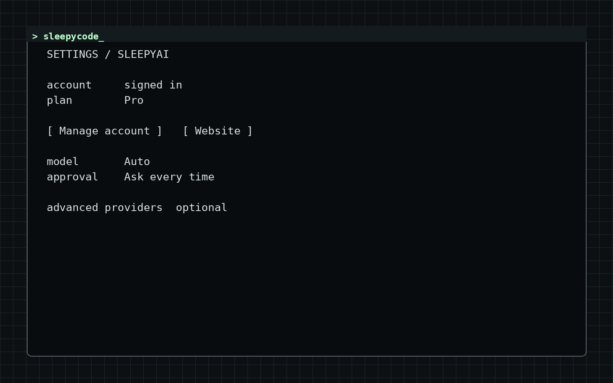

<p align="center">
  
</p>

<h1 align="center">SleepyCode</h1>
<p align="center"><strong>The SleepyAI coding agent inside Visual Studio Code.</strong></p>
<p align="center">Sign in with SleepyAI, choose an available model, and let the agent inspect, edit, run, and verify work directly in your repository.</p>

<p align="center">
  <a href="https://marketplace.visualstudio.com/items?itemName=TahsinArafat.sleepycode-agent"></a>
  <a href="https://marketplace.visualstudio.com/items?itemName=TahsinArafat.sleepycode-agent"></a>
  <a href="https://github.com/TahsinArafat/SleepyCode-VSCode/stargazers"></a>
  <a href="LICENSE"></a>
</p>

<p align="center">
  <strong><a href="https://marketplace.visualstudio.com/items?itemName=TahsinArafat.sleepycode-agent">Install from the VS Code Marketplace</a></strong>
  ·
  <a href="https://github.com/TahsinArafat/SleepyCode-VSCode/issues">Report a bug or request a feature</a>
</p>



SleepyCode brings a Codex-style agent loop to the editor you already use. Open a folder, choose a model, and describe the outcome you want. The agent can inspect the repository, plan the work, edit files, run commands, and show every step as it happens.

## Contents

- [Why SleepyCode](#why-sleepycode)
- [Quick start](#quick-start)
- [What it can do](#what-it-can-do)
- [Model providers](#model-providers)
- [Safety and approvals](#safety-and-approvals)
- [MCP, subagents, terminals, and memory](#mcp-subagents-terminals-and-memory)
- [Skills marketplace](#skills-marketplace)
- [Settings](#settings)
- [Commands](#commands)
- [Development](#development)

## Why SleepyCode

- **SleepyAI first:** SleepyAI account, model access, pricing, usage, and product behavior form the default experience.
- **Commercial account experience:** Browser/device sign-in, plan state, balance, spending limits, and server-authoritative SleepyAI usage are surfaced directly in the sidebar.
- **Advanced compatibility when needed:** Power users can manually add an OpenAI-compatible endpoint without turning third-party services into built-in defaults.
- **Focused agent workspace:** Start from Build, Debug, Review, or Understand tasks; choose a descriptive agent mode; and keep the composer compact.
- **Project intelligence:** SleepyCode builds a bounded local index of project files, symbols, imports, frameworks, and important entry points so relevant context can be found without re-scanning the whole repository on every request. The index is persisted per workspace and can be rebuilt from the home/context UI or with the `/reindex` command.
- **Explicit context control:** See and toggle project intelligence, the active file, and selected code; attach files/folders; and know what will be sent with the next request. A compact session-stats row under the composer shows current context-window usage, input/output lifetime token totals, approximate cost, and live tokens/second during runs.
- **Visible agent work:** Follow plans, reasoning, tool activity, retries, and streamed answers from the sidebar.
- **Workspace-aware:** Each folder gets its own project and conversation history.
- **Changes you can review:** Each completed response records its workspace file changes so you can diff or revert a file, stage the task, create a Git commit, jump to Source Control, or restore the task checkpoint.
- **Actionable failure states:** Expired sessions, plan/credit limits, context overflow, unavailable models, rate limits, and service failures render with the next useful action instead of a generic error string.
- **Built for recovery:** Editor undo and Git restore points make agent changes easier to inspect and roll back.
- **Extensible with skills:** Discover, preview, and install `SKILL.md` packages from SkillsMP or GitHub.
- **Your choice of control:** Confirm every action, trust repeated safe commands or edits for the current workspace session, auto-approve edits, or enable Open access.

## Quick start

1. [Install SleepyCode from the VS Code Marketplace](https://marketplace.visualstudio.com/items?itemName=TahsinArafat.sleepycode-agent).
2. Open a folder in VS Code.
3. Click the **terminal prompt** button in the editor title bar, or run **SleepyCode: Open Chat** from the Command Palette.
4. Complete the one-time setup by signing in to **SleepyAI**.
5. Keep **Auto** selected to use the lowest-cost eligible SleepyAI model (free models win when available), with A–Z as the deterministic fallback when pricing is unavailable. You can also choose a specific model from the alphabetized selector.

External OpenAI-compatible endpoints, SkillsMP, MCP servers, and SearXNG are optional advanced integrations.

## What it can do

### Work like a coding agent

- Read and search the active workspace
- Create, edit, and delete files within the workspace boundary
- Review proposed file diffs before they are applied in Ask mode
- Run commands with configurable approvals
- Keep named shell sessions alive for dev servers and interactive follow-up commands
- Delegate bounded exploration, review, and implementation work to subagents
- Use tools exposed by configured MCP servers
- Present a pinned plan before beginning multi-step work, with completed-step count and current-step progress
- Stream answers while showing collapsible tool and reasoning details
- Schedule one follow-up prompt and steer an active run
- Retry interrupted model streams instead of silently claiming completion

### Keep projects organized

- Maintain separate chat history for every VS Code folder
- Search, pin, rename, switch, archive, restore, and permanently delete conversations
- Copy messages and review timestamps
- Review per-file diffs, revert individual task files, stage task changes, create a commit, or restore the entire Git checkpoint
- Receive native completion, approval, and failure notifications
- Review **Usage & Billing** with SleepyAI plan/balance/allowance data plus local per-model activity
- Keep durable project decisions in `.sleepycode/memory.md`



## Model providers

**SleepyAI is the only built-in provider and the default route.** The extension signs in through SleepyAI, loads the model catalog exposed to the account, and surfaces SleepyAI subscription, balance, limits, and pricing data in the product UI.

For advanced compatibility, users may manually add an OpenAI-compatible endpoint from **Settings → Advanced Providers**. These endpoints are never preinstalled, never selected automatically on a fresh install, and are not a substitute for the first-party SleepyAI onboarding flow. Optional provider API keys are stored separately in VS Code SecretStorage and are never written to `settings.json`.

A manually added compatibility provider can define a base URL, optional API key, fallback model IDs, and custom HTTP headers. SleepyCode uses its `/models` endpoint when available and falls back to explicitly configured model IDs when discovery is unavailable.

### SleepyAI Auto

The SleepyAI model menu includes **Auto**. Auto is only available on the first-party SleepyAI route. SleepyCode compares the current SleepyAI pricing table and selects the model with the lowest combined input + output price; a fully free model therefore wins when available. Equal-price ties are resolved A–Z. If no candidate has complete pricing, Auto deterministically falls back to the first eligible model A–Z. The model actually used is recorded in live task activity and local usage diagnostics. Compatibility providers never receive a first-party Auto decision. Model dropdowns are also presented A–Z for predictable browsing.

### Project intelligence

When a workspace opens, SleepyCode builds a local, bounded project index. It records file paths, language, exported symbols, import specifiers, common frameworks, important configuration/entry files, and test-like files. The index is persisted in VS Code extension storage for that workspace and refreshed after source changes. File contents are read locally to build metadata; the full index is not sent to the webview or to a third-party indexing service.

For each request, SleepyCode performs lexical retrieval over that metadata and adds the most relevant paths/symbols as project context. The agent is still instructed to read a file before editing it; the index is navigation context, not a substitute for source inspection. Project intelligence can be disabled for an individual request from the Context panel or rebuilt manually from the home/context UI with `/reindex`.

### Session context window

The session stats row shows the tokens currently present in the model's context window for the next request, using the last completed turn's cached input-token count as a proxy between runs. During a live run it switches to live data. Lifetime input/output totals are shown separately as cumulative session metrics.

## Safety and approvals

SleepyCode constrains its built-in file tools to the active workspace. Common credential files such as `.env` are blocked, and provider API keys are kept in VS Code's encrypted SecretStorage.

| Mode | File edits | Commands | Destructive commands |
| --- | --- | --- | --- |
| **Ask** | Confirm | Confirm | Confirm |
| **Auto edits** | Automatic | Confirm | Confirm |
| **Open access** | Automatic | Automatic | Automatic |

In Ask mode, SleepyCode opens a VS Code diff containing the proposed content before asking you to apply or reject it. For non-destructive actions, you can trust repeated edits or an exact command for the **current workspace session**; these temporary approvals are kept only in memory and destructive actions still require explicit review. Applied edits use VS Code workspace edits and participate in editor undo. In Auto edits mode, file edits apply without prompting, but commands still require approval unless that exact command was trusted for the current workspace session. Open access is intentionally powerful; use it only in workspaces where you are comfortable allowing unattended commands.

## MCP, subagents, terminals, and memory

Configure MCP servers in Settings as a JSON object. Both local stdio servers and remote HTTP/SSE servers are supported:

```json
{
  "local-tools": {
    "command": "npx",
    "args": ["-y", "some-mcp-server"]
  },
  "remote-tools": {
    "url": "https://example.com/mcp",
    "headers": { "Authorization": "Bearer ${env:MCP_TOKEN}" }
  }
}
```

Each MCP tool is namespaced by server and follows the active approval mode. Connections are opened for the agent run and closed afterward.

The agent can delegate a bounded task to an **explorer**, **reviewer**, or **worker** subagent. Explorer and reviewer subagents are read-only; worker subagents can edit and verify through the same approval system as the parent.

Named persistent shell sessions remain alive across tool calls and conversations until they are explicitly stopped or the extension closes. Project memory is stored in `.sleepycode/memory.md`, loaded into future requests, and editable with **SleepyCode: Open Project Memory** from the Command Palette.

## Skills marketplace

SleepyCode can extend itself with `SKILL.md` packages from [SkillsMP](https://skillsmp.com) or a GitHub repository.



- **Discover:** Search popular or recently updated skills from the shop button beside Settings.
- **Preview:** Read a skill's instructions and inspect its GitHub source before installation.
- **Install:** Add the selected skill to SleepyCode's global extension storage after approval.
- **Use anywhere:** Installed skills are available across workspaces from the next request. Open **Installed** and click **Use**, or ask SleepyCode to use the skill by name. The agent then reads that installed skill's local `SKILL.md` before applying it.

You can also ask directly: *“Find me a skill for web scraping”* or *“Install the planning skill from `owner/repository`.”*

### Composer slash commands

Type `/` at the start of the composer to open SleepyCode’s command menu. Installed skills are suggested dynamically after `/skill `.

| Slash command | Action |
| --- | --- |
| `/skill <name> <task>` | Load the installed skill’s local `SKILL.md`, then perform the task with that workflow |
| `/plan <task>` | Inspect first and maintain a concrete implementation plan |
| `/fix <issue>` | Trace and fix a bug, then run relevant regression checks |
| `/review <scope>` | Review correctness, security, regressions, maintainability, and tests |
| `/test <scope>` | Run the most relevant checks and diagnose failures |
| `/explain <topic>` | Explain code/project behavior without modifying it unless asked |
| `/new` | Start a new conversation |
| `/settings` | Open SleepyCode settings |
| `/usage` | Open Usage & Billing |
| `/skills` | Open installed skills |
| `/marketplace` | Open Skill Marketplace |
| `/memory` | Open project memory |
| `/reindex` | Rebuild repository intelligence |
| `/context` | Open the composer context manager |
| `/model` | Open the model selector |
| `/agent` | Open the agent-mode selector |
| `/permissions` | Open approval/autonomy controls |

## Settings

Open the gear button in the SleepyCode sidebar or run **SleepyCode: Open Settings**.



| Setting | Purpose |
| --- | --- |
| Active provider | SleepyAI by default; optional compatibility endpoints are selected explicitly in the sidebar and stored in extension state |
| `sleepycode.model` | Selected model for the active provider |
| `sleepycode.maxSteps` | Maximum tool-loop steps per iteration; defaults to `50`. `0` allows unlimited steps. If unfinished work reaches the limit, use **Continue iteration** to resume without replaying completed work. |
| `sleepycode.approvalMode` | Ask, Auto edits, or Open access |
| `sleepycode.searxngUrl` | Optional SearXNG instance used by the web-search tool |
| `sleepycode.mcpServers` | JSON configuration for stdio, HTTP, or SSE MCP servers |
| `sleepycode.extraFreeModels` | Additional comma-separated model IDs to show (legacy setting name) |
| `sleepycode.systemNotifications` | Native task, approval, and failure notifications |

### Optional web search

Set a SearXNG base URL to enable the `web_search` tool. The server must allow JSON output with `format=json`.

- Local VS Code: `http://localhost:8888`
- Dev Containers or remote workspaces: use an address reachable from the extension host, such as the host LAN address or `host.docker.internal` where supported

See the [SearXNG installation documentation](https://docs.searxng.org/admin/installation.html) for setup options.

## Commands

| Command | Description |
| --- | --- |
| `SleepyCode: Open Chat` | Open SleepyCode in the secondary sidebar |
| `SleepyCode: Focus Chat` | Focus the current chat |
| `SleepyCode: Open Settings` | Open provider and agent settings |
| `SleepyCode: Usage & Billing` | Review SleepyAI account usage, plan/balance limits, and local model activity |
| `SleepyCode: Open Project Memory` | Open the active folder's durable memory file |
| `SleepyCode: Skill Marketplace` | Browse, preview, and install skills |
| `SleepyCode: New Chat` | Start a new conversation |
| `SleepyCode: Test System Notification` | Verify native notifications on the current platform |

## Requirements

- VS Code **1.106.0** or newer
- An internet connection and a SleepyAI account for the first-party model experience
- Optional: credentials for a manually added OpenAI-compatible endpoint
- Optional: SearXNG for web search

## Development

```bash
git clone https://github.com/TahsinArafat/SleepyCode-VSCode.git
cd SleepyCode-VSCode
npm install
npm run check
npm run build
npm run verify:release
```

Open the folder in VS Code and press `F5` to launch an Extension Development Host.

```bash
npm run package
```

The package command validates release metadata, runs the complete check suite, builds the extension, and creates a `.vsix` with `vsce`. GitHub Actions also runs check + build on Linux, Windows, and macOS, while the release workflow packages a clean VSIX artifact from a fresh `npm ci`.

## Known limitations

- SleepyAI model availability, pricing, quotas, and rate limits are controlled by the SleepyAI service and may change by account or plan.
- Optional external-provider compatibility depends on OpenAI-compatible chat/completions and model-discovery behavior; some endpoints may require custom headers or manual model IDs.
- Web search requires a user-provided SearXNG instance.
- Skills search and installation use SkillsMP and GitHub; unauthenticated GitHub API limits may apply.
- Git diff/revert/stage/commit controls require a Git-tracked workspace and a response that captured a task checkpoint. To avoid combining agent output with existing user work, SleepyCode refuses one-click stage/commit when a task file already contained pre-task changes; task commit also refuses unrelated pre-existing staged files. Use VS Code Source Control for explicit partial staging in those cases.
- Persistent terminal sessions use piped shells rather than a full PTY, so full-screen terminal applications are not supported.
- MCP authentication is configured through server headers or environment variables; interactive OAuth is not yet included.

## Support and contributing

Bug reports and feature requests are welcome in [GitHub Issues](https://github.com/TahsinArafat/SleepyCode-VSCode/issues). Include the SleepyCode version, VS Code version, SleepyAI account state (signed in/out), and selected model when reporting model-specific problems. If an optional compatibility provider is involved, include its endpoint type without sharing secrets.

Pull requests are welcome. Please run `npm run check` and `npm run build` before submitting changes.

## License

[MIT](LICENSE)

---

<p align="center">
  <sub>You made it to the end of the README. Here is the SleepyCode mascot:</sub>
</p>

```text
      /\_/\    zZ
     ( -.- )
      > ^ <
  $ sleepycode --ready
```

<p align="center">
  <sub><strong>SleepyCode</strong> — you code, the cat keeps watch.</sub>
</p>
